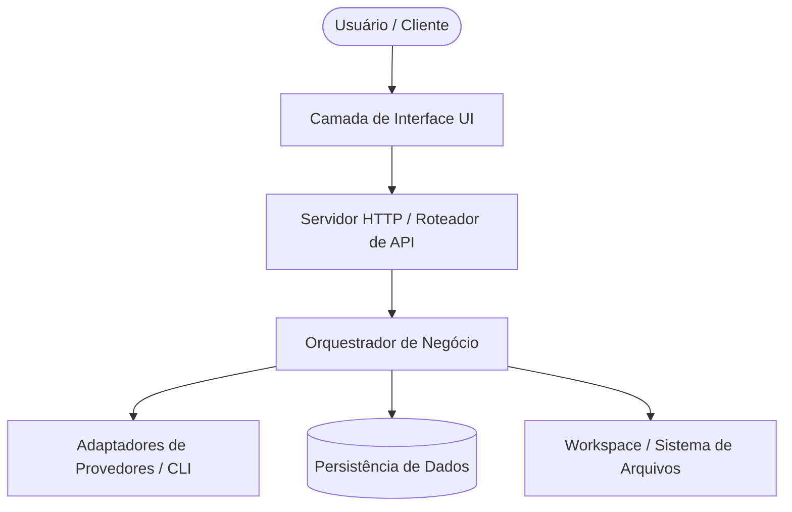

# Documento de Arquitetura de Software

## Objetivo
Estruturar o documento oficial de arquitetura técnica do sistema (`docs/architecture.md`), conduzido por Winston (Arquiteto de Software). O documento define formalmente a arquitetura de alto e baixo nível, a seleção e justificativa da stack tecnológica, os modelos de dados, componentes fundamentais, contratos de APIs, estrutura de diretórios, infraestrutura, estratégia de erros, convenções de código, testes e diretrizes inegociáveis de segurança.

## Entrada do Usuário
{{input}}

## Passos do Agente (Winston)
1. **Análise de Requisitos e Restrições:** Examine o PRD (`docs/prd.md`), os arquivos atualmente abertos no workspace (`openFiles`) e a entrada do usuário para compreender as demandas de escala, latência e segurança.
2. **Definição da Arquitetura de Alto Nível:** Modele os subsistemas, fronteiras de serviço e fluxos de comunicação em um diagrama Mermaid representativo.
3. **Seleção e Justificativa de Stack:** Preencha a tabela de tecnologias com justificativas técnicas sólidas e sem modismos, priorizando simplicidade operacional.
4. **Modelagem de Dados e Componentes:** Estruture as entidades centrais, schemas e responsabilidades de cada componente interno.
5. **Especificação de APIs e Endpoints:** Documente os contratos de entrada/saída, formatos de payload, códigos HTTP e fluxos de streaming/eventos.
6. **Políticas de Erro, Segurança e Padrões:** Estabeleça a taxonomia de exceções, defesas em profundidade, sanitização de dados e convenções de código limpo.
7. **Compilação do Documento Final:** Salve o artefato completo em `docs/architecture.md` e direcione para validação por Sarah (`po`).

## Perguntas de Elicitação (se faltarem dados)
- Há requisitos específicos de runtime (ex.: Node >= 18 puro, zero dependências externas npm)?
- Como será feita a persistência de dados (arquivos locais, banco relacional, armazenamento de sessão em memória)?
- Qual é o throughput esperado (operações por segundo, volume de leitura vs. escrita)?
- Existem requisitos mandatórios de conformidade ou limitações de ambiente (Windows, Linux, containers)?

---

## Esqueleto do Documento de Saída (`docs/architecture.md`)

```markdown
# 🏗️ Documento de Arquitetura de Software: [Nome do Projeto]

## 1. Introdução
- **Visão Geral:** [Resumo da solução arquitetural e seus objetivos de engenharia]
- **Escopo do Sistema:** [Limites do que o sistema executa e o que é delegado a sistemas externos]
- **Diretrizes e Restrições Principais:** [Ex: JavaScript puro CommonJS, Node >= 18, zero dependências npm, segurança offline]

## 2. Arquitetura de Alto Nível

- **Descrição dos Módulos Principais:**
  - *Camada de Interface (UI):* [Responsabilidade, isolamento e consumo de dados]
  - *Servidor HTTP / API:* [Tratamento de rotas, autenticação, headers de segurança e validação de schema]
  - *Núcleo Orquestrador:* [Coordenação de fluxo, party mode e ciclo de vida de mensagens]
  - *Provedores e Adaptadores:* [Comunicação com processos CLI ou serviços externos]

## 3. Tech Stack
| Camada | Tecnologia Escolhida | Versão Mínima | Justificativa Técnica |
|---|---|---|---|
| Runtime | Node.js | >= 18.0.0 | Plataforma assíncrona madura, suporte nativo a fetch, crypto e streams |
| Módulos | CommonJS (`require`) | Padrão Node | Compatibilidade direta com extensões VS Code e sem etapa de build |
| Front-End | HTML5 / CSS3 / Vanilla JS | Padrão W3C | Zero dependências de CDN, carregamento instantâneo e manutenibilidade |
| Armazenamento | Arquivos JSON locais | N/A | Persistência simples, portátil, versionável e sem necessidade de SGBD |
| Testes | Node Test Runner (`node:test`) | Nativo | Sem dependências externas, asserções nativas com `node:assert` |

## 4. Modelos de Dados
### Entidade 1: [Ex: Conversa / Conversation]
```json
{
  "id": "string (identificador único em base36)",
  "title": "string (máximo 60 caracteres)",
  "mode": "'chat' | 'party'",
  "agents": ["string (IDs dos agentes participantes)"],
  "createdAt": "number (timestamp ms)",
  "updatedAt": "number (timestamp ms)",
  "messages": []
}
```

### Entidade 2: [Ex: Mensagem / Message]
```json
{
  "id": "string",
  "role": "'user' | 'agent' | 'system'",
  "agentId": "string (opcional)",
  "content": "string (conteúdo markdown)",
  "ts": "number"
}
```

## 5. Componentes e Responsabilidades
- **Componente A:** [Responsabilidade única, entradas e saídas esperadas]
- **Componente B:** [Responsabilidade única, entradas e saídas esperadas]

## 6. Contratos de API (Endpoints)
| Método | Rota | Descrição | Corpo da Requisição | Resposta Esperada |
|---|---|---|---|---|
| GET | `/api/status` | Verificação de integridade | Vazio | `{ ok: true, version: "1.0.0" }` |
| POST | `/api/recurso` | Criação de entidade | `{ nome: string }` | `{ ok: true, id: "..." }` |

## 7. Estrutura de Pastas e Organização
```
projeto/
├── docs/                 # Documentos de especificação BMAD
│   ├── prd.md
│   └── architecture.md
├── src/ ou server/       # Código-fonte da aplicação
│   ├── http.js
│   └── api.js
└── test/                 # Testes automatizados
```

## 8. Infraestrutura e Deploy
- **Ambiente de Execução:** [Instância local, container Docker ou processo em background]
- **Configuração via Ambiente:** Variáveis declaradas em `.env` lidas sem sobrescrever variáveis de sistema.
- **Ciclo de Vida do Processo:** Inicialização limpa, tratamento de sinais de encerramento (`SIGINT`, `SIGTERM`) e fechamento gracioso de sockets.

## 9. Estratégia de Erros e Resiliência
- **Taxonomia de Erros:** Erros de validação (4xx) tratados com mensagens amigáveis em português; falhas inesperadas (5xx) registradas em log estruturado.
- **Fail-Safe e Fallbacks:** Quando um serviço secundário falha, o sistema deve continuar operando com funcionalidades degradadas de forma controlada.

## 10. Padrões de Código e Convenções
- **Estilo:** JavaScript idiomático moderno, nomes em inglês para identificadores e português para mensagens de usuário e UI.
- **Assincronismo:** Uso obrigatório de `async/await`; proibido o uso de callbacks aninhados (callback hell).
- **Sem mutações inesperadas:** Funções puras sempre que possível e imutabilidade de parâmetros de entrada.

## 11. Estratégia de Testes
- **Testes Unitários:** Foco em lógica de domínio, parsers e sanitizadores (`test/*.test.js`).
- **Testes de Integração:** Validação de chamadas HTTP reais e persistência em sistema de arquivos.

## 12. Segurança e Privacidade
- **Proteção contra Path Traversal:** Validação estrita de qualquer caminho de arquivo antes de operações de I/O.
- **Sanitização de Entradas:** Sanitização contra injeção de comandos, XSS e validação de tokens em cabeçalhos HTTP.
- **Sigilo de Credenciais:** Proibido registrar chaves de API, senhas ou tokens em arquivos de log.
```
