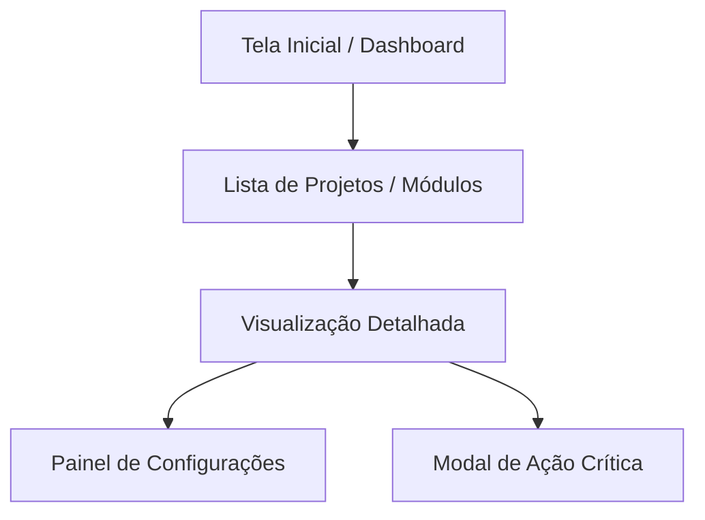

# Especificação de Front-End e UX

## Objetivo
Elaborar a especificação completa de experiência do usuário, design system e arquitetura de interfaces (`docs/front-end-spec.md`), conduzida por Sally (UX Expert). Este documento traduz os requisitos de produto descritos no PRD em diretrizes visuais precisas, fluxos navegacionais, tokens de estilo, comportamento de componentes e prompts detalhados para implementação em HTML/CSS/JS pelo time de desenvolvimento.

## Entrada do Usuário
{{input}}

## Passos do Agente (Sally)
1. **Compreensão das Necessidades e Personas:** Analise os requisitos funcionais e objetivos de usuário presentes na entrada.
2. **Definição da Linguagem Visual e Tokens:** Estruture as regras de cores semânticas, tipografia, escala modular de espaçamento, bordas e sombras.
3. **Mapeamento de Jornadas e Fluxos (User Flows):** Descreva as etapas do usuário passo a passo pelas telas da aplicação.
4. **Especificação de Componentes e Estados:** Detalhe a anatomia dos componentes de interface e especifique os estados obrigatórios (Default, Hover, Active, Focus, Disabled, Loading, Empty State, Error).
5. **Diretrizes de Acessibilidade (WCAG 2.1 AA):** Especifique contrastes mínimos, tags semânticas HTML, navegação por teclado e rótulos ARIA.
6. **Formulação de Prompts de Geração de UI:** Crie instruções precisas e semânticas que podem ser utilizadas por geradores de código ou pelo desenvolvedor James.
7. **Compilação do Artefato Final:** Gere o documento estruturado em `docs/front-end-spec.md` e aponte os próximos passos.

## Perguntas de Elicitação (se faltarem dados)
- O sistema terá suporte a tema escuro (Dark Mode) ou apenas tema claro?
- Quais são os limites de resolução de tela ou dispositivos prioritários (Desktop First, Mobile First, Responsivo)?
- Há restrições sobre o uso de frameworks CSS, ícones ou fontes locais?
- Qual é o nível de familiaridade técnica do usuário médio da interface?

---

## Esqueleto do Documento de Saída (`docs/front-end-spec.md`)

```markdown
# 🎨 Especificação de Front-End e UX: [Nome do Projeto]

## 1. Visão Geral e Princípios de UX
- **Objetivo da Interface:** [Proporcionar uma experiência fluida, sem atrito e de carregamento instantâneo]
- **Pilares de Experiência:**
  - *Clareza:* Redução máxima de poluição visual e destaque inequívoco das ações principais.
  - *Feedback Imediato:* Nenhuma interação do usuário ocorre sem sinalização visual clara.
  - *Eficiência:* Menor número possível de cliques para completar fluxos primários.

## 2. Personas e Cenários de Uso
- **Persona 1: [Nome / Papel]**
  - *Contexto de Uso:* [Quando, onde e por que acessa a ferramenta]
  - *Expectativas Chave:* [O que valoriza na navegação e visual]
  - *Principais Dores na Interface:* [Fricções a evitar]

## 3. Arquitetura de Informação e Fluxos de Navegação

- **Fluxo 1 (Caminho Feliz):** [Passo 1] → [Passo 2] → [Passo 3] → Confirmação.
- **Fluxo de Recuperação de Erro:** Exibição de banner de alerta com botão de repetição (Retry).

## 4. Design System e Tokens de Estilo
### Paleta de Cores Semântica
- `--bg-primary`: [Cor de fundo principal, ex: #1e1e2e ou #ffffff]
- `--bg-surface`: [Cor de cards e painéis, ex: #252538 ou #f8f9fa]
- `--text-primary`: [Cor de texto principal de alto contraste, ex: #cdd6f4 ou #111827]
- `--text-secondary`: [Cor de texto de apoio/secundário, ex: #a6adc8 ou #6b7280]
- `--brand-accent`: [Cor primária de destaque/ação, ex: #89b4fa ou #2563eb]
- `--status-success`: [Cor para estados concluídos, ex: #a6e3a1 ou #16a34a]
- `--status-warning`: [Cor para avisos de atenção, ex: #f9e2af ou #ca8a04]
- `--status-danger`: [Cor para erros e ações destrutivas, ex: #f38ba8 ou #dc2626]

### Tipografia e Escala
- **Família Tipográfica:** [Fontes de sistema modernas, sem dependências externas de CDN]
- **Tamanhos e Pesos:**
  - H1: 24px (Bold)
  - H2: 20px (Semi-Bold)
  - H3: 16px (Medium)
  - Body: 14px (Regular, line-height 1.5)
  - Small / Code: 12px (Regular)

### Espaçamento e Formas
- Escala de espaçamento: 4px, 8px, 12px, 16px, 24px, 32px.
- Raio de borda (border-radius): 4px para elementos pequenos, 8px para cards e modais.

## 5. Componentes Principais e Seus Estados
### Componente 1: [Ex: Botão de Ação Primária]
- **Estrutura:** [Tag `<button class="btn btn-primary">`, ícone opcional à esquerda, texto conciso]
- **Estados:**
  - *Default:* Fundo `--brand-accent`, texto de alto contraste.
  - *Hover:* Clareamento/escurecimento de 10% e transição suave (150ms).
  - *Active:* Escala levemente reduzida (0.98) e feedback tátil/visual.
  - *Focus:* Contorno (outline) de 2px acessível visível por navegação via Tab.
  - *Disabled:* Opacidade 50%, cursor `not-allowed`.
  - *Loading:* Spinner animado inline substituindo o ícone e desabilitando cliques.

### Componente 2: [Ex: Painel de Conteúdo / Card]
- **Estados:** Vazio (Empty State com ilustração e CTA explicativo), Com Dados, Em Carregamento (Skeleton/Spinner), Com Erro de Conexão.

## 6. Acessibilidade (WCAG 2.1 AA) e Responsividade
- **Navegação por Teclado:** Foco visível e ordem lógica de tabulação em todos os elementos interativos.
- **Rótulos e Semântica:** Uso correto de tags `<main>`, `<nav>`, `<section>`, `<article>`, `<button>` e atributos `aria-label` onde ícones forem usados sem texto.
- **Comportamento Responsivo:** Layout fluído com Grid/Flexbox sem overflow horizontal indesejado.

## 7. Prompts de Geração de UI
```text
Crie uma interface em HTML5 semântico e CSS puro vanilla para a tela [Nome da Tela].
Utilize as seguintes variáveis CSS: --bg-primary, --bg-surface, --text-primary, --brand-accent.
Inclua tratamento explícito de estados: loading, vazio e erro.
A interface deve ser totalmente acessível por teclado (WCAG AA) e livre de bibliotecas externas.
```

## 8. Handoff e Próximos Passos
- **Implementação Front-End:** James (`dev`) para construir o markup e estilos correspondentes.
- **Validação de Testes de UI:** Quinn (`qa`) para estruturar testes de acessibilidade e regressão visual.
```
